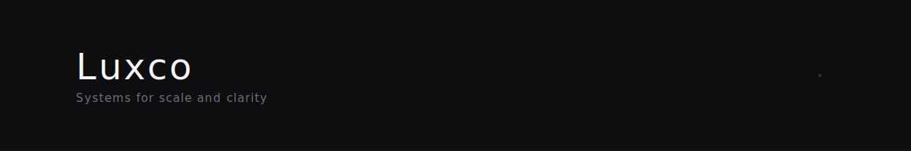
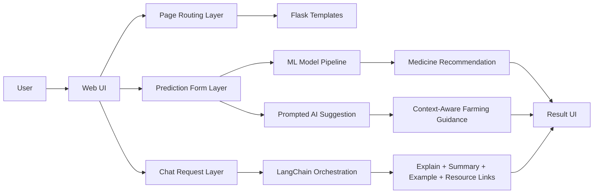
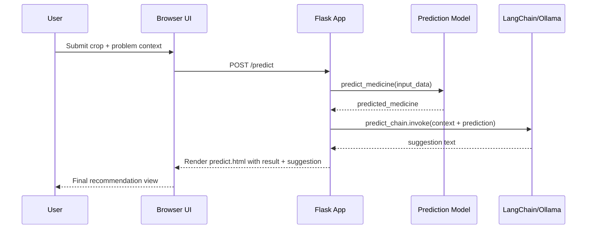

<svg xmlns="http://www.w3.org/2000/svg" width="1200" height="240" viewBox="0 0 1200 240">

  <!-- Background -->
  <rect width="1200" height="240" fill="#0d1117"/>

  <!-- Top subtle line -->
  <rect x="0" y="0" width="1200" height="1" fill="#30363d"/>

  <!-- Left accent -->
  <rect x="80" y="80" width="3" height="80" fill="#8b949e"/>

  <!-- Title -->
  <text x="110" y="120"
        fill="#e6edf3"
        font-family="Arial, Helvetica, sans-serif"
        font-size="48"
        letter-spacing="3">
    LUXCO
  </text>

  <!-- Tagline -->
  <text x="110" y="150"
        fill="#8b949e"
        font-family="Arial, Helvetica, sans-serif"
        font-size="16">
    Systems • Infrastructure • Precision
  </text>

  <!-- Bottom divider -->
  <rect x="0" y="239" width="1200" height="1" fill="#30363d"/>

</svg>

---

<p align="center">
  
  
  
  
  
  
</p>

<p align="center">
  <strong>Full-stack agriculture intelligence system for crop problem support, medicine prediction, AI guidance, and immersive learning pages.</strong>
</p>

---

## Skills Stickers (Linked)

<p>
  <a href="https://www.python.org/" target="_blank"></a>
  <a href="https://flask.palletsprojects.com/" target="_blank"></a>
  <a href="https://scikit-learn.org/" target="_blank"></a>
  <a href="https://www.langchain.com/" target="_blank"></a>
  <a href="https://ollama.com/" target="_blank"></a>
  <a href="https://developer.mozilla.org/en-US/docs/Web/HTML" target="_blank"></a>
  <a href="https://developer.mozilla.org/en-US/docs/Web/CSS" target="_blank"></a>
  <a href="https://developer.mozilla.org/en-US/docs/Web/JavaScript" target="_blank"></a>
  <a href="https://www.mongodb.com/" target="_blank"></a>
  <a href="https://pandas.pydata.org/" target="_blank"></a>
  <a href="https://numpy.org/" target="_blank"></a>
  <a href="https://jupyter.org/" target="_blank"></a>
</p>

---

## Concept Vision

Krushi AI Platform is built as a modern agriculture web system where design quality and practical AI utility work together in one product.
It combines:

* a clean multi-page agricultural interface
* a crop medicine recommendation workflow
* an AI assistant for farming-related responses
* structured domain context (crop, problem, weather, soil, stage, severity)
* educational and engagement sections (reel/video/media pages)

This project is designed for portfolio strength, learning depth, and real-world agriculture-tech presentation.

---

## Core Idea Architecture



---

## High-Impact Features

### 1) Multi-Page Agriculture Experience

* Dedicated pages for home, krushi, chatbot, prediction, reel, sale, and machines.
* Structured user flow designed for discovery, support, and action.

### 2) Crop Medicine Prediction Engine

* Input dimensions: crop, problem, weather, soil, growth stage, severity.
* Uses a `DecisionTreeClassifier` with one-hot encoding over the agriculture dataset.

### 3) AI Farming Assistant

* LangChain + Ollama based conversational support.
* Produces explanation, summary, examples, and optional resource links.

### 4) Context-Driven Suggestion Layer

* Prediction output is injected into an expert-style prompt template.
* Returns actionable guidance aligned with model prediction context.

### 5) Modern Presentation Layer

* Portfolio-ready front-end pages with media sections and agriculture storytelling.
* Built to feel like a complete digital product, not only a demo script.

---

## Technology Matrix

<p>
  
  
  
  
  
  
</p>

* **Frontend:** HTML, CSS, JavaScript
* **Backend:** Flask (Python)
* **ML:** OneHotEncoder + DecisionTreeClassifier
* **LLM:** ChatOllama (`mistral`) through LangChain
* **Data Source:** `professional_crop_medicine_dataset_6000_rows.csv`

---

## Request-to-Response Flow



---

## Project Concepts Covered

* Rule-based web routing with Flask templates
* Feature engineering via categorical encoding
* ML inference integration in web runtime
* Prompt engineering for domain-specific guidance
* Multi-output AI response design (explain/summary/example/resources)
* Hybrid pipeline: deterministic ML + generative LLM
* Product-oriented UI structure for technical storytelling

---

## Routes Overview

| Route       | Method | Purpose                             |
| ----------- | ------ | ----------------------------------- |
| `/`         | GET    | Landing page                        |
| `/krushi`   | GET    | Agriculture content page            |
| `/sale`     | GET    | Sale page                           |
| `/machines` | GET    | Machines page                       |
| `/chatbot`  | GET    | Chat interface page                 |
| `/predict`  | GET    | Prediction page                     |
| `/predict`  | POST   | Prediction + AI suggestion pipeline |
| `/reel`     | GET    | Reel/video page                     |
| `/get`      | POST   | Chatbot JSON response endpoint      |

---

## Directory Snapshot

```text
again chatbot app for clearly flask/
├── app.py
├── model.py
├── llm_chain.py
├── stream_api.py
├── video_pr/
├── static/
│   └── video_pr.mp4
├── professional_crop_medicine_dataset_6000_rows.csv
├── templates/
└── README.md
```

---

## Demo Video

<p align="center">
  <video src="static/video_pr.mp4" controls width="800"></video>
</p>

---

## Setup

```bash
pip install flask langchain langchain-ollama scikit-learn pandas duckduckgo-search
python app.py
```

Open: `http://127.0.0.1:5000`

---

## Future Upgrade Directions

* Add confidence scores and explanation traces for prediction decisions
* Introduce dataset versioning and model persistence workflow
* Add multilingual responses and region-aware recommendations
* Create user history and analytics dashboard for advisory tracking
* Integrate weather APIs and location-aware agronomy context

---

## Contribution Direction

Contributions are welcome in:

* model improvement and evaluation
* UI system enhancement
* prompt quality refinement
* API hardening and validation
* architecture modularization

---

## License

This project is intended for educational, portfolio, and demonstration use.
